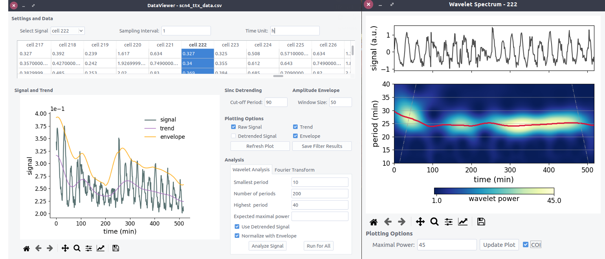

# pyBOAT - A Biological Oscillations Analysis Toolkit ##

[](https://gitter.im/pyBOATbase/support?utm_source=badge&utm_medium=badge&utm_campaign=pr-badge&utm_content=badge) 
[](https://badge.fury.io/py/pyboat)
[](https://anaconda.org/conda-forge/pyboat)
[](https://anaconda.org/conda-forge/pyboat) 

Tools for time-frequency analysis of noisy time series. More details can be found in the
accompanying manuscript [Optimal time frequency analysis for biological data - pyBOAT](https://biorxiv.org/cgi/content/short/2020.04.29.067744v3). For help, questions or comments please join the official chat on [gitter](https://gitter.im/pyBOATbase/support) or write an email to gregor.moenke@esi-frankfurt.de. 

pyBOAT features a multi-layered graphical user interface. Here an example screenshot showing the `DataViewer`(left), where preprocessing of individual signals gets visualized, and the resulting `Wavelet Spectrum` with a ridge tracing the detected  main oscillatory component with a  $\sim$ 24h period (right):



### Features ###

* x-platform GUI
* Optimal sinc filter
* Fourier analysis
* Wavelet analysis 
* Ridge detection, phase and amplitude extraction
* Synthetic signal generator
* Ensemble statistics

See also the sister project [SpyBoat](https://github.com/tensionhead/spyBOAT) for spatially resolved time-frequency analysis with wavelets.

### Documentation

- [Installation and Updates](./doc/install.md)
- [Quick Start](./doc/guide.md)

For the public API see the [single signal demonstration](./scripting_demo.py) and the [ensemble statistics](./ensemble_demo.py) example. Consult the respective Python docstrings for further details.

### Quick install via conda

```conda install -c conda-forge pyboat```

