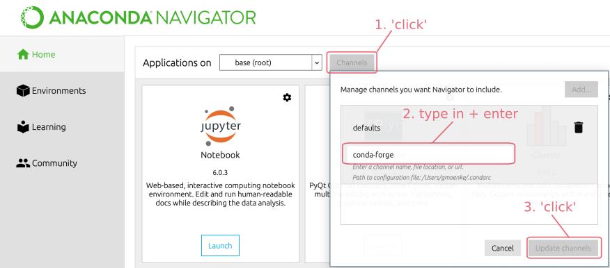
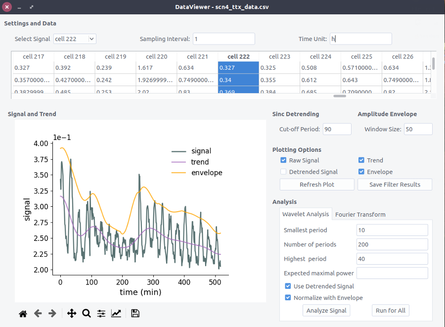

## pyBOAT - A Biological Oscillations Analysis Toolkit ##


[](https://badge.fury.io/py/pyboat)
[](https://gitter.im/pyBOATbase/support?utm_source=badge&utm_medium=badge&utm_campaign=pr-badge&utm_content=badge) 
[](https://anaconda.org/conda-forge/pyboat)
[](https://anaconda.org/conda-forge/pyboat) 

Tools for time-frequency analysis of noisy time series. The
accompanying manuscript "Optimal time frequency analysis for biological data - pyBOAT"
can be found [here](https://biorxiv.org/cgi/content/short/2020.04.29.067744v3). For help, questions or comments please join the official chat at [gitter](https://gitter.im/pyBOATbase/support) or write an email to gregor.moenke@esi-frankfurt.de. 

### Features ###

* Optimal sinc filter
* Fourier analysis
* Wavelet analysis 
* Ridge detection
* Phase extraction
* Amplitude estimation
* Synthetic signal generator
* Ensemble statistics

### Installation with Anaconda Navigator ###

pyBOAT is written in Python and therefore requires Python to be present
on the system.
An easy way to install a cross-platform scientfic Python
environment is to use the freely availabe [Anaconda Distribution](https://www.anaconda.com/products/individual).
Installation instructions can be found here: https://docs.anaconda.com/anaconda/install/, 
a Python 3.x version is needed.

Once the Anaconda installation is complete, starting up the ```Anaconda Navigator```
will show an interface like this:



First clicking on ```Channels``` and then on ```Add...``` will open an input field.
Type ```conda-forge``` into it and
confirm with the &#9166; enter key. Now after hitting ```Update channels```, the
community packages hosted on the ```conda-forge``` channel will become available. As pyBOAT
is also a Navigator App, it will now (along with other apps) show up in the main Navigator window:


Finally hitting ```Install``` will download and install pyBOAT. Thereafter,
pyBOAT can be started by simply clicking on ```Launch``` inside the Navigator.

#### Updates

In case you see a little blue arrow next to the version number, this means
an update is available. Clicking on the cogwheel icon in the upper right corner
allows to run the update and install the latest version of pyBOAT.


#### Installation with Anaconda on the commandline ####

For this, the download and installation of [miniconda](https://docs.conda.io/en/latest/miniconda.html)
is sufficient. Once ```conda``` is available on the commandline, typing

```conda config --add channels conda-forge```

will add the ```conda-forge``` channel to your conda. pyBOAT can then be installed with:

```conda install pyboat```

Now typing ```pyboat``` into the commandline will launch the GUI, and the ```pyboat```
module is available for your Python environment.


### Using  pip ###

pyBOAT is listed on the [Python Package Index (PyPI)](https://pypi.org/project/pyboat)
and can be directly installed using ```pip```. In case you don't have/want Anaconda, 
see here for install instructions for pip itself: https://pip.pypa.io/en/stable/installing/. 

To install pyboat simply type

```pip install pyboat```

into the command line. This makes the ```pyboat``` Python module available for import.
The graphical user interface (GUI) can be started by typing

```pyboat```

into the command line.

For running directly from the source, see also [this document](./doc/gui_from_source.md)


## Usage ##
-------------

Almost every input field and checkbox has a tool tip attached for quick reference.

### Data import ###

In general pyBOAT expects tabular data, with each column
representing a signal. Just open your saved time-series data by using ``` Open ``` 
from the (small) main window. Supported input formats are:
``` .xls, .xlsx, .csv, .tsv``` and ```.txt ```. For other file
extensions, white space separation of the data is assumed.
Please see examples of the supported formats in the 
``` example_data ``` directory of this repository.

In case you want to interpolate missing data or you want to define your own
separator, the ```Import..``` button will spawn a menu with further options.

### Analysis ###

After successful import, you can simply click on the table representing
your data to select a specific time-series in the ``` DataViewer ```. 
Alternatively, select a specific time-series from the drop-down menu in the upper left.
To get the correct numbers/units you can change the ```Sampling Interval```
and ```Time Unit``` name in the top line of the ``` DataViewer ```. 
The general layout of the ```DataViewer``` to set up the analysis is shown here:



#### Detrending  ####


The featured sinc-detrending is an optimal high-pass filter and removes low frequencies (high periods) 
from the signal via a sharp ``` cut-off-period ```. Details of the implementation can be found at 
[The Scientist and Engineer's Guide to Digital Signal Processing](http://www.dspguide.com/).
Check the ``` Trend ``` and/or ``` Detrended Signal ``` checkbox(es) 
and click ``` Refresh Plot ``` 
to see the effect of the filter on the selected time series.

#### Amplitude Envelope ####

If there is a strong trend in the amplitudes alone, for example a slow decay, pyBOAT offers
a simple sliding-window operation to estimate this envelope. The ```Window Size```
controls the time-window in which each amplitude is estimated. 
Check the ``` Envelope ``` checkbox and click ``` Refresh Plot ``` 
to see the detected envelope. When running the
Wavelet analysis, there is an option ```Normalize with Envelope``` to remove it
from the signal.

#### Setting up the Wavelet Analysis ####

Set the parameters for the Wavelet Analysis in the lower right:

| Input Field   | Meaning    |
| --- | --- |
| Smallest Period | Lower period bound <br> (Nyquist limit built-in)  |
| Number of Periods | Resolution of the transform <br> or number of convolutions             |   
| Highest Period | Upper period bound <br> Should not exceed observation time     |
| Expected maximal power | Upper bound for the colormap <br> indicating the Wavelet power <br> normalized to white noise |

Leave the ``` Use the detrended signal ``` box checked if you want to use the sinc-detrending. 
``` Analyze Signal ``` will perform the Wavelet transform of the selected signal. 

### Wavelet Power Spectrum  ###

The input signal for the Wavelet analysis and the resulting 2d-power-spectrum are shown with aligned time axis. 
The y-axis indicates the periods(frequencies) selected for analysis. 
Bright areas indicate a high Wavelet power around this period(frequency) at that time of the signal. Some synthetic signals
for demonstrational purposes can be found in ``` /example_data/synth_signal.csv ```.

Set a new ```Maximal Power``` and hit ```Update Plot``` to rescale the heatmap if needed.

The *cone of influence* (COI) can be plotted on top of the spectrum by checking the
respective box. 


####  Ridge Analysis ####

To extract intantaneous frequency and associated phase, a 1d-*ridge* (a profile) has to be traced through the 
2d-power spectrum:

```math
f = ridge(t)
```
This maps **one** frequency (or period) to **one** time point.

The simplest way is to connect all time-consecutive power-maxima. This is what
``` Detect Maximum Ridge ``` does. This works well for all of the examples found in 
``` /data_examples/synth_signal.csv ```.

To exclude parts of the spectrum whith 
low Wavelet power, indicating that no oscillations wihtin the chosen period(frequency)
range are present at that time, set a ``` Ridge Threshold ```. The actual ridge is indicated as a
red line in spectrum plot, note that no default ridge is shown in a fresh 
``` Wavelet Spectrum ``` window. For a quick check hit the ``` Detect Maximum Ridge ``` button. 
You can also smooth the ridge if needed.

### Ridge Results ###


Once it is found, the complex Wavelet transform can be evaluated *along*
that ridge yielding a complex time series: $`z(t)`$. 

```math
z(t) = \mathcal{W}_\Psi[s](t, ridge(t) )
``` 
``` Plot Results ``` will then show the extracted
instantaneous periods(frequencies), the phase and power profile along the ridge:

```math
period(t) = 1/ridge(t)
```
```math
phase(t) = arg[z(t)]
```
```math
power(t) = abs[z(t)]
```

