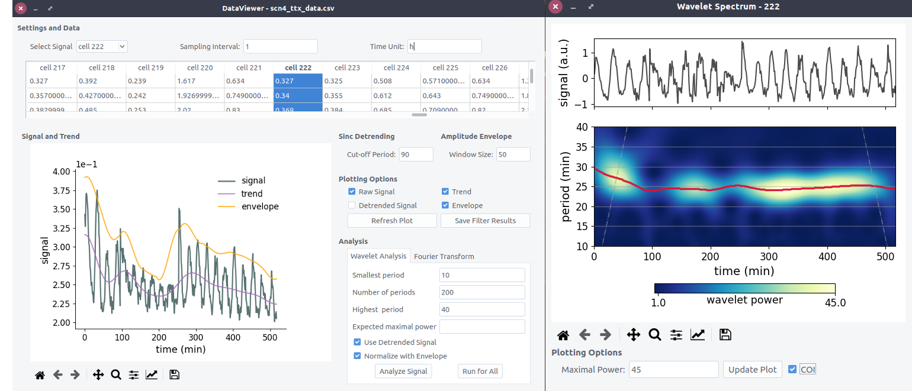

# pyBOAT - A Biological Oscillations Analysis Toolkit ##

[](https://gitter.im/pyBOATbase/support?utm_source=badge&utm_medium=badge&utm_campaign=pr-badge&utm_content=badge) 
[](https://badge.fury.io/py/pyboat)
[](https://anaconda.org/conda-forge/pyboat)
[](https://anaconda.org/conda-forge/pyboat) 


Tools for time-frequency analysis of noisy time series. More details can be found in the
accompanying manuscript [Optimal time frequency analysis for biological data - pyBOAT](https://biorxiv.org/cgi/content/short/2020.04.29.067744v3). For help, questions or comments please join the official chat on [gitter](https://gitter.im/pyBOATbase/support), write [an issue](https://github.com/tensionhead/pyBOAT/issues) or [start a discussion](https://github.com/tensionhead/pyBOAT/discussions).

[Installation](#installation)

[Documentation](#documentation)

pyBOAT features a modular, multi-layered graphical user interface. The example screenshot displays the `DataViewer`(left) used for signal inspection and preprocessing, paired with the resulting `Wavelet Spectrum`, which shows a ridge tracking the main oscillatory component with a  $\sim$ 24h period (right):



### Features ###

* x-platform GUI
* High-pass sinc filter
* Fourier analysis
* Wavelet analysis 
* Ridge detection, phase and amplitude extraction
* Synthetic signal generator
* Batch processing
* Ensemble statistics

See also the sister project [SpyBoat](https://github.com/tensionhead/spyBOAT) for spatially resolved time-frequency analysis with wavelets.

### Installation

**Linux**:

```bash
python -m venv venv-pyboat
source venv-pyboat/bin/activate
pip install pyboat
```

**MacOS**:

Download the latest `pyBOAT-1.x.x.dmg` file from the [release page](https://github.com/tensionhead/pyBOAT/releases/latest), right-click (or Control-click) the installer and select 'Open' to bypass the macOS *untrusted developer* warning. 

**Windows** 

Download the latest `pyBOAT-1.x.x.msi` file from the [release page](https://github.com/tensionhead/pyBOAT/releases/latest) and run the setup wizard to install.

**Via Anaconda Navigator** (legacy)

[See here..](./doc/install.md)

### Documentation

- [Quick Start](./doc/guide.md)
- [Introductional Video](https://youtu.be/1bhFhqhfdfk)

For the public API see the [single signal demonstration](./scripting_demo.py) and the [ensemble statistics](./ensemble_demo.py) example. Consult the respective Python docstrings for further details.

### Quick install via command line

With pip:

```pip install pyboat```

or with conda:

```conda install -c conda-forge pyboat```

Then start the UI from the terminal:

```pyboat```

or use `import pyboat` in your Python scripts.
