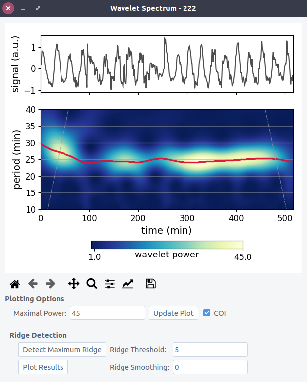
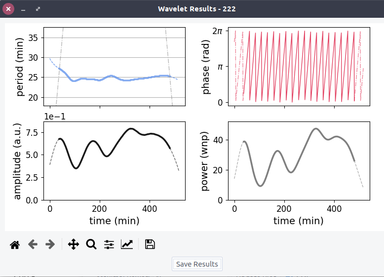

# User Guide #

Note that almost every input field and checkbox has a status tip displayed in the lower left corner of the application windows.

### Data import ###

In general pyBOAT expects tabular data, with each column
representing a signal. Just open your saved time-series data by using ``` Open ``` 
from the (small) main window. Supported input formats are:
``` .xls, .xlsx, .csv, .tsv``` and ```.txt ```. For other file
extensions, white space separation of the data is assumed.
Have a look at [some examples](../example_data) of the supported formats in the 
``` example_data ``` directory of this repository.

In case you want to interpolate missing data or you want to define your own
separator, the ```Import..``` button will spawn a menu with further options.

### Analysis ###

After successful import, you can simply click on the table representing
your data to select a specific time-series in the ``` DataViewer ```. 
Alternatively, select a specific time-series from the drop-down menu in the upper left.
To get the correct numbers/units you can change the ```Sampling Interval```
and ```Time Unit``` name in the top line of the ``` DataViewer ```. 
The general layout of the ```DataViewer``` to set up the analysis is shown here:


#### Detrending  ####


The featured sinc-detrending is an optimal high-pass filter and removes low frequencies (high periods) 
from the signal via a sharp ``` cut-off-period ```. Details of the implementation can be found at 
[The Scientist and Engineer's Guide to Digital Signal Processing](http://www.dspguide.com/).
Check the ``` Trend ``` and/or ``` Detrended Signal ``` checkbox(es) 
and click ``` Refresh Plot ``` 
to see the effect of the filter on the selected time series.

#### Amplitude Envelope ####

If there is a strong trend in the amplitudes alone, for example a slow decay, pyBOAT offers
a simple sliding-window operation to estimate this envelope. The ```Window Size```
controls the time-window in which each amplitude is estimated. 
Check the ``` Envelope ``` checkbox and click ``` Refresh Plot ``` 
to see the detected envelope. When running the
Wavelet analysis, there is an option ```Normalize with Envelope``` to remove it
from the signal.

#### Setting up the Wavelet Analysis ####

Set the parameters for the Wavelet Analysis in the lower right:

| Input Field   | Meaning    |
| --- | --- |
| Smallest Period | Lower period bound <br> (Nyquist limit built-in)  |
| Number of Periods | Resolution of the transform <br> or number of convolutions             |   
| Highest Period | Upper period bound <br> Should not exceed observation time     |
| Expected maximal power | Upper bound for the colormap <br> indicating the Wavelet power <br> normalized to white noise |

Leave the ``` Use the detrended signal ``` box checked if you want to use the sinc-detrending. 
``` Analyze Signal ``` will perform the Wavelet transform of the selected signal. 

### Wavelet Power Spectrum  ###

The input signal for the Wavelet analysis and the resulting 2d-power-spectrum are shown with aligned time axis. 
The y-axis indicates the periods(frequencies) selected for analysis. 
Bright areas indicate a high Wavelet power around this period(frequency) at that time of the signal. Some synthetic signals
for demonstrational purposes can be found in ``` /example_data/synth_signal.csv ```.

Set a new ```Maximal Power``` and hit ```Update Plot``` to rescale the heatmap if needed.

The *cone of influence* (COI) can be plotted on top of the spectrum by checking the
respective box. 




####  Ridge Analysis ####

To extract intantaneous period/frequency and associated phase, a 1d-*ridge* (a curve or profile) has to be traced through the 
2d-power spectrum:

$$f_{inst} = ridge(t)$$

This maps **one** frequency (or period) to **one** time point.

The simplest way is to connect all time-consecutive power-maxima. This is what
``` Detect Maximum Ridge ``` does. This works well for all of the examples found in 
``` /data_examples/synth_signal.csv ```.

To exclude parts of the spectrum whith 
low Wavelet power, indicating that no oscillations wihtin the chosen period(frequency)
range are present at that time, set a ``` Ridge Threshold ```. The actual ridge is indicated as a
red line in spectrum plot, note that no default ridge is shown in a fresh 
``` Wavelet Spectrum ``` window. For a quick check hit the ``` Detect Maximum Ridge ``` button. 
You can also smooth the ridge if needed.

### Ridge Results ###

Once it is found, the complex Wavelet transform can be evaluated *along*
that ridge yielding a complex time series: $z(t)$. 

$$z(t) = \mathcal{W}_\Psi[s](t, ridge(t) )$$

``` Plot Results ``` will then show the extracted
instantaneous periods(frequencies), the phase and power along the ridge:

$$period(t) = 1/ridge(t)$$

$$phase(t) = arg[z(t)]$$

$$power(t) = abs[z(t)]$$


