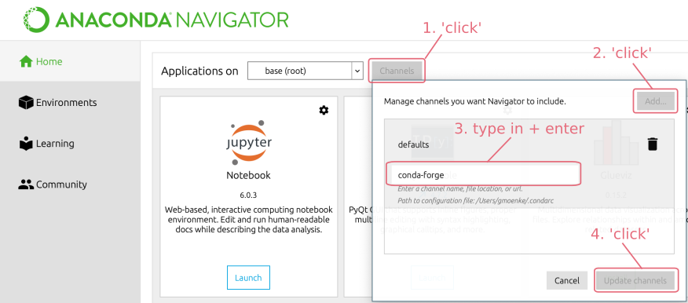
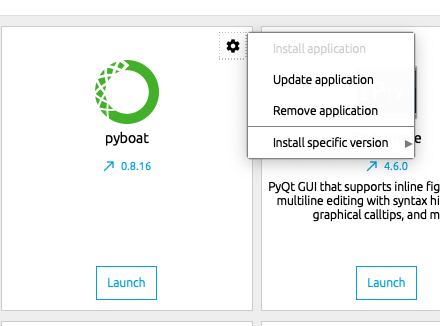

### Installation with Anaconda Navigator ###

pyBOAT is written in Python and therefore requires Python to be present
on the system.
An easy way to install a cross-platform scientfic Python
environment is to use the freely availabe [Anaconda Distribution](https://www.anaconda.com/products/individual).
Installation instructions can be found here: https://docs.anaconda.com/anaconda/install/, 
a Python 3.x version is needed.

Once the Anaconda installation is complete, starting up the ```Anaconda Navigator```
will show an interface like this:



First clicking on ```Channels``` and then on ```Add...``` will open an input field.
Type ```conda-forge``` into it and
confirm with the &#9166; enter key. Now after hitting ```Update channels```, the
community packages hosted on the ```conda-forge``` channel will become available. As pyBOAT
is also a Navigator App, it will now (along with other apps) show up in the main Navigator window:


Finally hitting ```Install``` will download and install pyBOAT. Thereafter,
pyBOAT can be started by simply clicking on ```Launch``` inside the Navigator.

#### Updates

In case you see a little blue arrow next to the version number, this means
an update is available. Clicking on the cogwheel icon in the upper right corner
allows to run the update and install the latest version of pyBOAT.




#### Installation with Anaconda on the commandline ####

For this, the download and installation of [miniconda](https://docs.conda.io/en/latest/miniconda.html)
is sufficient. Once ```conda``` is available on the commandline, typing

```conda config --add channels conda-forge```

will add the ```conda-forge``` channel to your conda. pyBOAT can then be installed with:

```conda install pyboat```

Now typing ```pyboat``` into the commandline will launch the GUI, and the ```pyboat```
module is available for your Python environment.


### Using  pip ###

pyBOAT is listed on the [Python Package Index (PyPI)](https://pypi.org/project/pyboat)
and can be directly installed using ```pip```. In case you don't have/want Anaconda, 
see here for install instructions for pip itself: https://pip.pypa.io/en/stable/installing/. 

To install pyboat simply type

```pip install pyboat```

into the command line. This makes the ```pyboat``` Python module available for import.
The graphical user interface (GUI) can be started by typing

```pyboat```

into the command line.

For running directly from the source, see also [this document](./gui_from_source.md)
