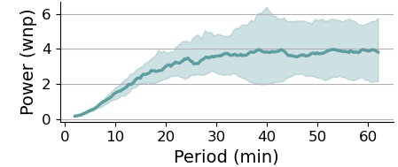

# Brief description of the example datasets

## `AR1_0.7_ensemble.csv`
- completely aperiodic dataset
- 100 AR(1) realizations with $\alpha=0.7$
- ensemble dynamics reveal continuous background spectrum
- comma separated values (`csv`)

##### Example analysis output: ensemble and time averaged Wavelet spectra

Reproduce via: 
- `Open` --> AR1_0.7_ensemble.csv
- click on arbitrary signal to trigger the dynamics defaults 
- `Analyze all..`
- check the `Global Fourier Estimate` checkbox
- `Analyze 100 Signals!`
